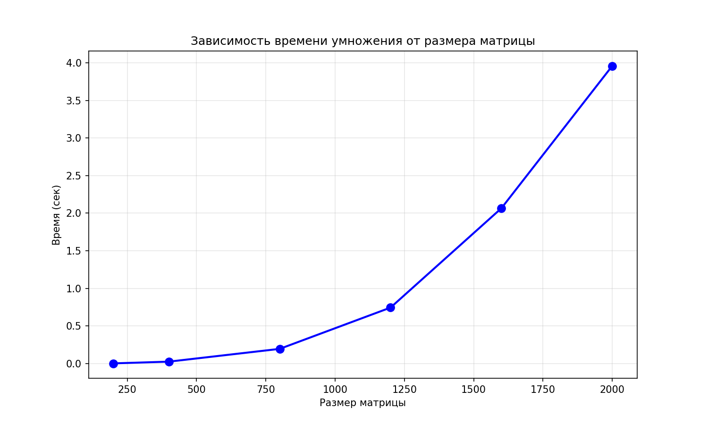

# Лабораторная работа №1
## Умножение квадратных матриц: анализ времени выполнения

В данной работе реализовано умножение двух квадратных матриц с замерами времени выполнения и объёма данных для различных размерностей.  
Используемые размеры матриц: 200, 400, 800, 1200, 1600, 2000.

---

## Состав проекта

| Файл | Описание |
|------|----------|
| gen.py | Генерирует квадратные матрицы указанных размеров, заполняя их случайными целыми числами от 0 до 1000. Матрицы сохраняются в папку matrices/ в формате CSV. |
| main.cpp | Основная программа на C++. Выполняет умножение матриц (тройной цикл), замеряет время выполнения, вычисляет объём данных и сохраняет результат. Автоматически вызывает verify.py для проверки через NumPy. |
| verify.py | Верификация результатов. Сравнивает матрицу, полученную в C++, с результатом умножения через библиотеку NumPy. |
| plot.py | Считывает results/times.csv, выводит таблицу результатов, строит график зависимости времени и объёма данных от размера матрицы и сохраняет его. |

---

## Порядок выполнения работы

### 1. Генерация матриц

py gen.py

В папке matrices/ будут созданы файлы:
a_200.csv, b_200.csv, a_400.csv, b_400.csv, ..., a_2000.csv, b_2000.csv.

### 2. Компиляция и запуск C++ программы

mkdir results
g++ -std=c++11 -O2 -o main.exe main.cpp -mconsole
.\main.exe

Программа последовательно обрабатывает все размеры, выводит время выполнения, объём данных и результат верификации для каждого.  
Результаты дописываются в файл results/times.csv.

### 3. Построение графика и таблицы

py plot.py

Скрипт выведет таблицу в консоль, откроет график и сохранит его как results/graph.png.

---

## Результаты

### Таблица результатов

| Размер матрицы | Время выполнения (сек) | Объём данных (МБ) |
|:--------------:|:----------------------:|:-----------------:|
| 200 | 0.003 | 0.46 |
| 400 | 0.026 | 1.83 |
| 800 | 0.196 | 7.32 |
| 1200 | 0.745 | 16.48 |
| 1600 | 2.066 | 29.30 |
| 2000 | 3.959 | 45.78 |

### График зависимости

---

## Верификация результатов

Для каждого размера матрицы выполняется автоматическая проверка: результат, полученный в C++, сравнивается с результатом умножения тех же матриц с помощью библиотеки NumPy (Python).  
Все проверки подтвердили корректность реализации.

---

## Вывод

1. Реализован классический алгоритм умножения квадратных матриц (тройной вложенный цикл) со сложностью O(N³).
2. Экспериментальные данные подтверждают теоретическую оценку: при увеличении размера матрицы в 2 раза время выполнения возрастает примерно в 8 раз.
3. Объём обрабатываемых данных растёт квадратично относительно размера матрицы.
4. Автоматическая верификация через NumPy гарантирует корректность вычислений.
5. Полученные результаты (таблица и график) наглядно демонстрируют кубическую зависимость времени выполнения от размера матрицы.