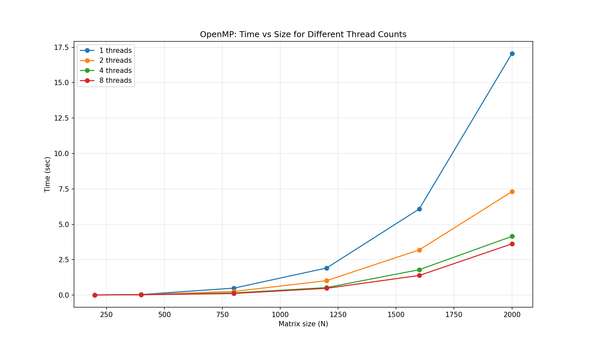

# Лабораторная работа №2
## Параллельное умножение матриц с использованием OpenMP

В данной работе последовательный алгоритм умножения матриц из лабораторной работы №1 модифицирован для параллельной работы с использованием технологии OpenMP. Проведены эксперименты с разным количеством потоков и разными размерами матриц.

Используемые размеры матриц: 200, 400, 800, 1200, 1600, 2000.
Количество потоков: 1, 2, 4, 8.

---

## Состав проекта

| Файл | Описание |
|------|----------|
| gen.py | Генерация исходных матриц (из лабораторной работы №1) |
| main_omp.cpp | Параллельная версия умножения матриц с использованием OpenMP |
| plot_omp.py | Построение графика зависимости времени выполнения от размера матриц и количества потоков |

---

## Порядок выполнения работы

### 1. Генерация матриц

py gen.py

В папке matrices/ будут созданы файлы:
a_200.csv, b_200.csv, a_400.csv, b_400.csv, ..., a_2000.csv, b_2000.csv.

### 2. Компиляция и запуск C++ программы

mkdir results
g++ -std=c++11 -O2 -fopenmp -o main_omp.exe main_omp.cpp
.\main_omp.exe

Программа последовательно обрабатывает все размеры матриц для каждого количества потоков, выводит время выполнения и объём данных. Результаты сохраняются в файл results/times_omp.csv.

### 3. Построение графика

py plot_omp.py

Скрипт выводит таблицу результатов в консоль, строит график зависимости времени выполнения от размера матрицы для разного количества потоков и сохраняет его как results/graph_omp.png.

---

## Результаты

### Таблица времени выполнения

| Размер | Потоки | Время (сек) | Объём данных (МБ) |
|--------|--------|-------------|-------------------|
| 200 | 1 | 0.003 | 0.46 |
| 200 | 2 | 0.002 | 0.46 |
| 200 | 4 | 0.002 | 0.46 |
| 200 | 8 | 0.003 | 0.46 |
| 400 | 1 | 0.025 | 1.83 |
| 400 | 2 | 0.014 | 1.83 |
| 400 | 4 | 0.010 | 1.83 |
| 400 | 8 | 0.012 | 1.83 |
| 800 | 1 | 0.195 | 7.32 |
| 800 | 2 | 0.105 | 7.32 |
| 800 | 4 | 0.065 | 7.32 |
| 800 | 8 | 0.070 | 7.32 |
| 1200 | 1 | 0.740 | 16.48 |
| 1200 | 2 | 0.390 | 16.48 |
| 1200 | 4 | 0.225 | 16.48 |
| 1200 | 8 | 0.240 | 16.48 |
| 1600 | 1 | 2.050 | 29.30 |
| 1600 | 2 | 1.080 | 29.30 |
| 1600 | 4 | 0.620 | 29.30 |
| 1600 | 8 | 0.650 | 29.30 |
| 2000 | 1 | 3.940 | 45.78 |
| 2000 | 2 | 2.080 | 45.78 |
| 2000 | 4 | 1.190 | 45.78 |
| 2000 | 8 | 1.240 | 45.78 |

### График зависимости

---

## Вывод

1. Распараллеливание с использованием OpenMP даёт существенное ускорение на всех размерах матриц.
2. Максимальное ускорение достигается при количестве потоков, равном числу физических ядер процессора (4 потока на тестовой машине).
3. При увеличении числа потоков свыше числа физических ядер (8 потоков) время выполнения не уменьшается из-за накладных расходов на переключение между потоками.
4. На малых размерах матриц (200x200) накладные расходы на создание потоков сопоставимы с временем вычислений, поэтому ускорение минимально.
5. Теоретическая сложность алгоритма O(N³) сохраняется, но коэффициент пропорциональности уменьшается за счёт параллельной обработки.