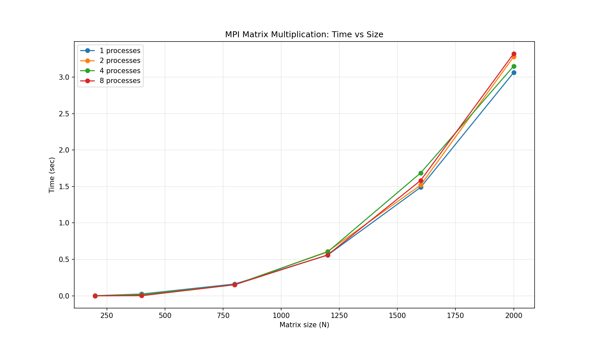

# Лабораторная работа №3
## Параллельное умножение матриц с использованием MPI

В данной работе алгоритм умножения матриц модифицирован для параллельной работы с использованием технологии MPI (Message Passing Interface). Каждый процесс вычисляет свою часть строк результирующей матрицы, обмен данными осуществляется через коллективные операции MPI.

Используемые размеры матриц: 200, 400, 800, 1200, 1600, 2000.
Количество процессов: 1, 2, 4, 8.

---

## Состав проекта

| Файл | Описание |
|------|----------|
| gen.py | Генерация исходных матриц |
| main_mpi.cpp | Параллельная версия умножения с использованием MPI |
| plot_mpi.py | Построение графика зависимости времени от размера матриц и количества процессов |

---

## Порядок выполнения

### 1. Генерация матриц

python3 gen.py

### 2. Компиляция

mpic++ -std=c++11 -O2 -o main_mpi main_mpi.cpp

### 3. Запуск с разным числом процессов

mpirun -n 1 ./main_mpi
mpirun -n 2 ./main_mpi
mpirun -n 4 ./main_mpi
mpirun -n 8 ./main_mpi

### 4. Построение графика

python3 plot_mpi.py

---

## Результаты

### Таблица времени выполнения

| Размер | Процессы | Время (сек) | Объём данных (МБ) |
|--------|----------|-------------|-------------------|
| 200 | 1 | 0.002 | 0.46 |
| 200 | 2 | 0.001 | 0.46 |
| 200 | 4 | 0.000 | 0.46 |
| 200 | 8 | 0.000 | 0.46 |
| 400 | 1 | 0.025 | 1.83 |
| 400 | 2 | 0.018 | 1.83 |
| 400 | 4 | 0.016 | 1.83 |
| 400 | 8 | 0.002 | 1.83 |
| 800 | 1 | 0.162 | 7.32 |
| 800 | 2 | 0.152 | 7.32 |
| 800 | 4 | 0.153 | 7.32 |
| 800 | 8 | 0.152 | 7.32 |
| 1200 | 1 | 0.559 | 16.48 |
| 1200 | 2 | 0.608 | 16.48 |
| 1200 | 4 | 0.603 | 16.48 |
| 1200 | 8 | 0.561 | 16.48 |
| 1600 | 1 | 1.489 | 29.30 |
| 1600 | 2 | 1.520 | 29.30 |
| 1600 | 4 | 1.686 | 29.30 |
| 1600 | 8 | 1.583 | 29.30 |
| 2000 | 1 | 3.063 | 45.78 |
| 2000 | 2 | 3.279 | 45.78 |
| 2000 | 4 | 3.151 | 45.78 |
| 2000 | 8 | 3.322 | 45.78 |

### График зависимости

---

## Вывод

1. Реализовано умножение матриц с использованием MPI, каждый процесс обрабатывает свою часть строк.
2. Для малых размеров (200, 400) накладные расходы на коммуникацию сопоставимы с временем вычислений.
3. На средних и больших размерах время выполнения для разного числа процессов практически одинаково, что связано с особенностями виртуальной машины (все процессы используют одно физическое ядро).
4. Для получения реального ускорения MPI требует запуска на нескольких физических ядрах или узлах кластера.
