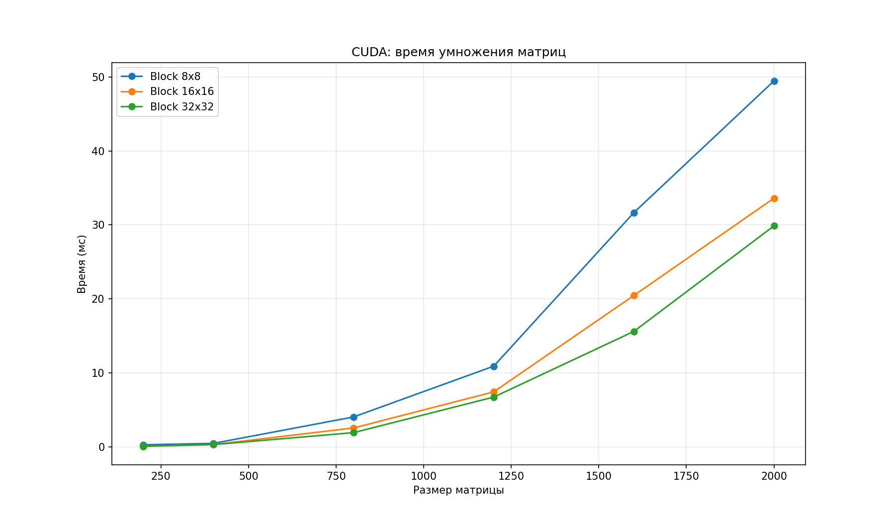

# Лабораторная работа №4
## Умножение матриц с использованием CUDA

В данной работе алгоритм умножения матриц реализован с использованием технологии CUDA на GPU NVIDIA Tesla T4 (Google Colab). Проведены эксперименты с разными размерами матриц и конфигурациями блоков.

Используемые размеры матриц: 200, 400, 800, 1200, 1600, 2000.
Размеры блоков: 8x8, 16x16, 32x32.

---

## Состав проекта

| Файл | Описание |
|------|----------|
| main_cuda.cu | Программа на C++ с CUDA-ядром для умножения матриц на GPU |
| plot_cuda.py | Построение графика зависимости времени от размера матрицы и размера блока |
| results_cuda.csv | Результаты экспериментов |
| graph_cuda.png | График зависимости времени выполнения |

---

## Порядок выполнения

### 1. Загрузка файлов в Google Colab

from google.colab import files
files.upload()

### 2. Компиляция

!nvcc -o main_cuda main_cuda.cu

### 3. Запуск

!./main_cuda

### 4. Построение графика

!python3 plot_cuda.py

---

## Результаты

### Таблица времени выполнения

| Размер | Блок | Время (мс) |
|--------|------|------------|
| 200 | 8x8 | 0.262 |
| 200 | 16x16 | 0.052 |
| 200 | 32x32 | 0.068 |
| 400 | 8x8 | 0.449 |
| 400 | 16x16 | 0.287 |
| 400 | 32x32 | 0.283 |
| 800 | 8x8 | 4.026 |
| 800 | 16x16 | 2.536 |
| 800 | 32x32 | 1.903 |
| 1200 | 8x8 | 10.893 |
| 1200 | 16x16 | 7.417 |
| 1200 | 32x32 | 6.713 |
| 1600 | 8x8 | 31.667 |
| 1600 | 16x16 | 20.456 |
| 1600 | 32x32 | 15.596 |
| 2000 | 8x8 | 49.488 |
| 2000 | 16x16 | 33.615 |
| 2000 | 32x32 | 29.874 |

### График зависимости

---

## Вывод

1. Реализовано умножение матриц с использованием CUDA на GPU Tesla T4.
2. Размер блока существенно влияет на производительность: блок 8x8 показывает худшие результаты, блоки 16x16 и 32x32 значительно быстрее.
3. Оптимальный размер блока для данной задачи — 32x32, на больших матрицах он даёт наименьшее время.
4. По сравнению с последовательной версией (лабораторная работа №1), GPU обеспечивает ускорение в десятки раз на матрицах большого размера.
5. GPU наиболее эффективен при обработке больших объёмов данных, где параллелизм используется максимально.