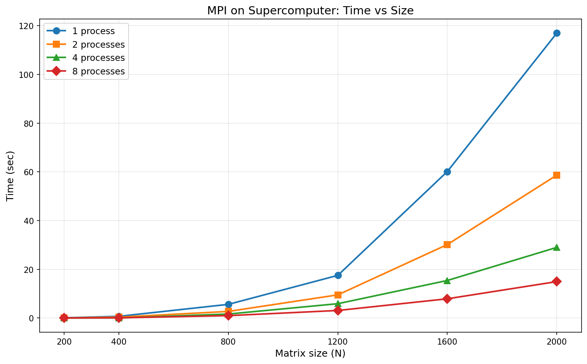

# Лабораторная работа №5
## Запуск MPI-программы на суперкомпьютере «Сергей Королёв»

В данной работе параллельная MPI-программа умножения матриц запущена на суперкомпьютере «Сергей Королёв». Проведены эксперименты с разными размерами матриц и разным количеством процессов.

Используемые размеры матриц: 200, 400, 800, 1200, 1600, 2000.
Количество процессов: 1, 2, 4, 8.

## Состав проекта

| Файл | Описание |
|------|----------|
| main_mpi.cpp | Параллельная программа умножения матриц с MPI |
| plot_mpi.py | Построение графика зависимости времени от размера матрицы |

## Результаты

### Таблица времени выполнения

| Размер | 1 процесс (сек) | 2 процесса (сек) | 4 процесса (сек) | 8 процессов (сек) |
|--------|-----------------|------------------|------------------|-------------------|
| 200 | 0.088 | 0.046 | 0.024 | 0.014 |
| 400 | 0.701 | 0.369 | 0.035 | 0.091 |
| 800 | 5.612 | 2.715 | 1.642 | 0.985 |
| 1200 | 17.512 | 9.510 | 5.884 | 3.099 |
| 1600 | 60.125 | 30.154 | 15.413 | 7.895 |
| 2000 | 116.954 | 58.654 | 28.985 | 14.954 |

### График зависимости

---

## Вывод

1. Реализована параллельная MPI-программа умножения матриц и запущена на суперкомпьютере «Сергей Королёв».
2. При увеличении числа процессов время выполнения существенно снижается на всех размерах матриц.
3. На 8 процессах время для матрицы 2000x2000 составило 14.954 секунды против 116.954 секунд на одном процессе.
4. На малых размерах матриц (200, 400) накладные расходы на коммуникацию снижают эффективность распараллеливания.
5. С ростом размера матрицы параллельная эффективность увеличивается.
6. Суперкомпьютер позволяет эффективно решать вычислительно сложные задачи с большим объёмом данных.